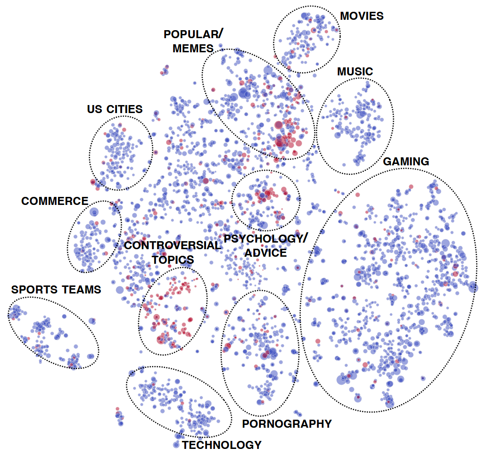

# Echoes of reality

> Fall 2025 - EPFL Applied Data Analysis Project 

>*By Eugène Bergeron, Mattia Bianco, Andrea Bissoli, Florian Dejean and Fabio Marchetti*  
## Data Story

You can visit our Data Story website [here](https://eor-ada.netlify.app)!

You can also find the data's repository on [GitHub](https://github.com/epfl-ada/ada-2025-project-ambassadorsfordataappreciation).
## Abstract
Our project focuses on **correlation** between **Reddit posts' sentiments and emotions** and **real life events**.  
We use the [Reddit Hyperlink Network dataset](https://snap.stanford.edu/data/soc-RedditHyperlinks.html) and the related [Subreddit Embeddings dataset](https://snap.stanford.edu/data/web-RedditEmbeddings.html), and integrate it with the [Stock Market Dataset](https://www.kaggle.com/datasets/jacksoncrow/stock-market-dataset) in order to introduce additional data points from the real world.
Our motivation stems from the hypothesis that large online platforms like Reddit act as **social reflections** of the anxieties and shifts **of the physical world** in near-real time. We have found out if, and in what measure, we can observe the measurable effects of **seasons, stock market trends and high-impact real world events** on how Reddit users interact with each other. Hence, our data story is focused on narrating how and if this collective mood shifts, providing a data-driven narrative.

     
    
*Communities in Reddit: each node represents a community. Red nodes initiate more conflicts, while blue nodes do not. Communities are embedded using user-community information. Figure taken from the [original paper](https://cs.stanford.edu/~srijan/pubs/conflict-paper-www18.pdf).*

## Research Questions
Main question: *Can we see an impact of real-world events on Reddit posts?*  
Sub-questions, driving our narrative:
1. How do emotions vary over the seasons and months of the year?
1. Is the stock market trend related to Reddit sentiment? Can you predict market behavios by observing sentiments of related Subreddits ? 
1. Can we leverage machine learning to effectively predict different aspects of Reddit sentiment based on real-world data? 

## Additional Datasets
1. **Subreddit Embeddings Dataset**: https://snap.stanford.edu/data/web-RedditEmbeddings.html. We leverage the embeddings dataset with the Reddit Hyperlink Network dataset to enrich our analysis with information on subreddit relationships and topics. We carried out an initial exploratory analysis on the embeddings to identify clusters of related subreddits. Even though not all subreddits in the Hyperlink Network dataset were present in the Embeddings dataset, the merged data will still be useful to filter and categorize posts based on subreddit topics.  

2. **Stock Market Dataset**:  https://www.kaggle.com/datasets/jacksoncrow/stock-market-dataset. Used to map Reddit Hyperlink Network to real world data. Allowing us to understand how close are Reddit's behavior to the stock market of a given brand, such as Apple.

## Disclaimer
This website was made with the help of LLMs. 